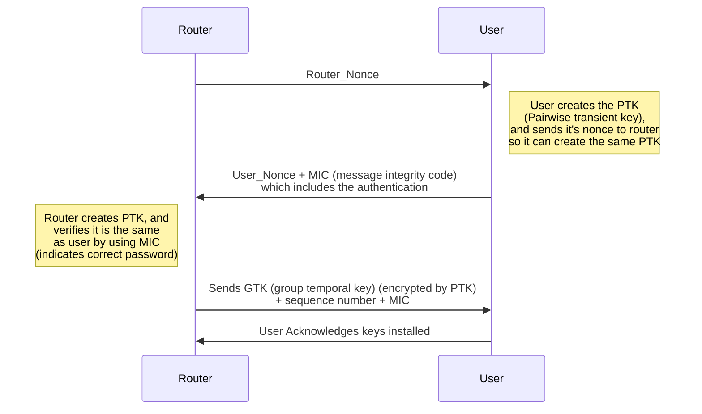

# Airgeddon
[Airgeddon](https://github.com/v1s1t0r1sh3r3/airgeddon) is a penetration testing tool made to perform a variety of attacks against wireless access points. These attacks can be used by penetration testers to audit the security of wireless access points or networks. Airgeddon is a bash script that brings together many standalone hacking tools that you may or may not be aware of into one convenient interface.

Some of the more popular tools that are used by the script are:

- [Aircrack-ng](https://www.aircrack-ng.org/)
- [Hashcat](https://hashcat.net/hashcat/)
- [BeEF](https://beefproject.com/)
- [John the Ripper](https://www.openwall.com/john/)
- [Bully](https://github.com/kimocoder/bully)
- [Reaver](https://github.com/t6x/reaver-wps-fork-t6x)
- [bettercap](https://www.bettercap.org/intro/)
- [tshark](https://tshark.dev/)

These are just the more well-known tools it uses you can see the essential tools [here](https://github.com/v1s1t0r1sh3r3/airgeddon/wiki/Essential%20Tools) and the optional tools [here](https://github.com/v1s1t0r1sh3r3/airgeddon/wiki/Optional%20Tools). These tools all combine to make airgeddon a powerful tool that includes [functionality](https://github.com/v1s1t0r1sh3r3/airgeddon/wiki/Features) for:
- WPA/WPA2
	- personal network handshake and PMKID capturing
- Offline password decryption
	- dictionary, brute force or rule-based attacks
- Evil Twin attacks (rogue access point)
	- Create a fake access point to spoof a real one then gets unsuspecting users to connect to it
	- Create captive portal to phish for the real network’s password
	- Once connected use ssl strip to downgrade security and sniff network packets for passwords and other sensitive information
- WPS
	- WPS scanning
	- Pixie dust attacks
	- PIN brute forcing
	- Known PIN attacks
	- Null PIN attack
- Enterprise Network Attacks
	- Create evil twin access point to capture enterprise credentials
	- Smooth and noisy modes to evade detection or to just hammer the network
- WEP all-in-one attack
	- If you would like to know more about WEP and WEP cracking [here's](https://null-byte.wonderhowto.com/how-to/hack-wi-fi-hunting-down-cracking-wep-networks-0183712/) an article from Null Byte Wonder How To, that uses aircrack-ng

As you can see airgeddon has a ton of functionality, whether you’re auditing your home WiFi or large enterprise networks airgeddon has the capability to fit your needs. Unfortunately, because it has so much functionality, I won’t be able to go over it all in 10 minutes so I will focus on personal network WPA/WPA2 handshake attacks, WPS attacks and Evil Twin attacks because I think they are the most relevant to you, I am able to set up a personal network for a demo and I think they are just fun.

## So How Do We Go About Hacking WiFi networks?

First things first, you’re going to need the proper equipment in terms of software and hardware.

### Software
I will be using a [VirtualBox](https://www.virtualbox.org/) version of [Kali Linux](https://www.kali.org/) which can be found [here](https://www.kali.org/get-kali/#kali-virtual-machines). You will also need to [install airgeddon](https://github.com/v1s1t0r1sh3r3/airgeddon/wiki/Installation%20&%20Usage#generic-installation) onto kali which can be done by entering three simple commands into the terminal.
```
git clone https://github.com/v1s1t0r1sh3r3/airgeddon.git
cd airgeddon
sudo bash airgeddon.sh
```
Once the third command is run the airgeddon script will start and check if you have all the necessary packages installed and if you don’t it will ask if you want it to install them for you, to which you should say yes.

Airgeddon can also be used on other operating systems such as Windows or Mac OSX using docker and you can find instructions for that setup [here](https://github.com/v1s1t0r1sh3r3/airgeddon/wiki/Docker). It can also be used in much the same way as with kali on other [compatible Linux distrobutions](https://github.com/v1s1t0r1sh3r3/airgeddon/wiki/Compatibility).

### Hardware
To run attacks against WiFi networks you need to have a WiFi adapter that can do packet injection so most likely the WiFi adapter you have in your laptop or computer won't work. Specifically, its the wireless chipset within the adapter that will determine if it can do packet injection or not. A list of compatible cards and chipsets can be found [here](https://github.com/v1s1t0r1sh3r3/airgeddon/wiki/Cards%20and%20Chipsets).
I personally have the Alpha AWUS036NHA with the Atheros AR9271 chipset, and the Alpha AWUS036ACM with the MediaTek MT7612U chipset.
##### Alpha AWUS036NHA

Shown here is the Alpha AWUS036NHA USB WiFi adapter with the Atheros AR9271 chipset. It is by far the most popular and widely compatible adapter. Attached to it is the 5 dBi antenna that it came with and next to it is a 9 dBi antenna that i got off amazon. The larger antenna is not required although it does help a lot with range if you are not close to the WiFi network you are attacking.  I bought this adapter many years ago and it still works great today. However, when using airgeddon with it I was having trouble capturing handshake files and after a while i realised it was not anything to do with airgeddon or the adapter, but it was because this adapter is only capable of using 2.4 GHz WiFi. My router and many newer routers connect devices using the 5 Ghz WiFi frequency by default which was not the case 7 years ago when I bought the adapter. Back then 2.4 GHz was the default with the option to turn on 5 GHz. So, while this adapter is really good, it is starting to show its age and won’t help you with penetration testing many newer networks unless they have some older devices connected on 2.4 GHz. My network had no such devices and instead of turning off 5 GHz and pissing off all my roommates while their devices reconnect, I dusted off my old iPhone 4 which doesn't have 5 GHz capabilities to use in initial testing.

##### Alpha AWUS036ACM

Due to the shortcomings of the previous adapter i decided to get a newer one with 2.4 and 5 GHz capabilities and the one I chose was the Alpha AWUS036ACM with MediaTek MT7612U chipset. This adapter is listed as having problems with kali virtual machines in the airgeddon compatibility list, but I didn’t run into those issues, and I read in a couple forums with newer versions of kali it isn’t an issue anymore.  This adapter worked excellent and also, I found had more than adequate range without upgrading the antennas.

## Network Recon
Next you are going to need to do some recon and figure out the type of network you are dealing with and what kind of security it has so you can attack it. To perform wireless recon, you will have to put your WiFi adapter in monitor mode which is done by typing 2 on the main airgeddon screen. There are two types of networks you will encounter personal and enterprise.

### Enterprise Network
It will be obvious if you are dealing with an enterprise network because when you click to join the network it will ask you for a username and password. An example of this would be our university WiFi uwosecure-v2. These networks are much larger than your home network and consist of many physical and virtual networks and protocols that connect users and devices to a shared local area network (LAN). Devices on these networks are connected together using ethernet, WiFi, switches and routers so they can share data securely within the network. Airgeddon has enterprise attack functionality which is option 10 on the main menu.

### Personal Network
This is the type of network we are going to focus on in this presentation. It is the most common type of network and is what your home WiFi would be characterised as. It requires only a password which contrasts with a username and password combination that is needed for enterprise networks. These networks are often comprised of a router and possibly some WiFi extender pods.

For demonstration purposes in the presentation, I will be using the personal hotspot on my iPhone to create a WiFi network with a weak password which is just "password" and I will be connecting my old iPhone 6 to it as a dummy user.

## Network Security
Personal WiFi networks can have different kinds of security and authentication mechanisms and which ones it has will change the way you attack it. The different security protocols are wired equivalent privacy (WEP), WiFi protected setup (WPS), WiFi protected access (WPA/WPA2-PSK), and recently WPA3. WEP is very old, insecure and not really used anymore so I won’t be covering it but here’s a [link](https://null-byte.wonderhowto.com/how-to/hack-wi-fi-hunting-down-cracking-wep-networks-0183712/) with more information if you are curious. WPA3 is very new, and I haven’t seen any routers with it yet although I’m sure they are out there but airgeddon has no attacks for it so I also won’t be covering it. Most networks you will come across will be protected by WPA/WPA2 and possibly WPS and these are the protocols I will focus on.

### WPS
WiFi protected setup is another layer added to routers that was meant to ease authentication by using a button or a small PIN. The WPS attacks section of airgeddon is number 8 on the main menu. From there, there are 5 kinds of attacks.

#### Custom PIN association
This attack lets you recover the WPA-PSK password if you know the WPS PIN

#### Pixie Dust Attack
This attack is made possible by manufacturers that used bad random number generators to create secret nonces. Knowing the two non-random nonces the attack is able to recover the WPS PIN within a couple of minutes.

#### Brute Force
WPS has a PIN that cannot be changed and is mated to the router forever. There are several problems with this for one the PINs were eight-digit numbers and that made them vulnerable to brute forcing. The last digit of the PIN was a checksum so 10^7=10,000,000 possible combinations which could be brute forced in less than a day. However, most router manufactures caught onto this and made most have a timeout after an incorrect pin is guessed which makes this attack not feasible.

#### Known PINs database attack
Some manufactures used security through obscurity and just assumed people wouldn’t figure out what algorithm they used to calculate the pins (which are derived from the router MAC address). They were wrong...so a certain list of routers can be accessed by calculating the pin from the MAC addres

#### Null PIN attack
This one is rarer to find but some really bad WPS router implementations allowed the null pin to connect

### WPA/WPA2
This is the type of security you will mostly see in personal networks and is one of the ones we will be attacking. WPA2 came out in 2004 and is an upgrade on the original WPA that came out in 2003. WPA is an encryption system that allows people to authenticate themselves to a router and then also encrypt each packet flowing to and from the router.

#### 4-Way Handshake Attack
The weakness airgeddon exploits lies in the authentication/encryption protocol called WPA2 pre-shared key (PSK). The protocol uses something called the 4-way handshake to authenticate the user and exchange the information it and the user need to create a shared secret so traffic can be encrypted. Here because of the wireless nature of communications when a user connects to the router for the first time if we put our WiFi adapter in monitor mode and just get it to capture all the traffic flowing to the router, we can try to capture all the information given away during the unencrypted 4-way handshake. With this information we have everything we need to try to recover the password offline using a dictionary attack or brute force. However, users don’t often have to enter the password to their WiFi network so to force this situation to happen we can flood the router with deauthentication packets to kick users off and since most devices are set up to reconnect automatically this will force the 4-way handshake to happen when we want it to. Below is a diagram of the 4-way handshake and the information that is transmitted by each party.

The pre-shared key is just the hashed WiFi password salted with the SSID and is never sent over the air but rather is just calculated by the router and user individually since they both have everything you need (password and SSID).

**PSK = Hash_Function(Wi-Fi password + Wi-Fi SSID, Length of SSID + 4096 iterations of SHA1)**

The PSK is not used to encrypt traffic, but it is used to derive the pairwise transit key (PTK) which is then used to encrypt all data flowing between the user and the router.

**PTK = PSK + Router_nonce + User_nonce + MAC (router) and MAC (user)**

Now while all of this stuff is happening during the 4-way handshake we are secretly capturing all of it. Now we have the user_nonce, router_nonce, router MAC and user MAC, all we need is the PSK which we cant get without the password. However, what we can do is guess a password and create our own PTK then use the MIC to verify if we got it right. So now we will bootstrap that and just try a ton of different passwords until we get the right one. The best part is we don’t even need the router now this can be done entirely offline.

## 4-Way Handshake Demo
1. From the main menu type 2 to put network card in monitor mode so we can search for targets
2. type 5 for handshake/PMKID tools menu
3. type 4 to explore for targets this shouldn't take too long and once u think you've gathered enough intel you can press ctrl+c to end the search
	* Press enter and it will start to scan for WiFi networks that are protected by WPA/WPA2
	* You will see several things on the screen that just popped up first you’ll see a column that says PWR that number the closer it is to 0 the closer the WiFi network is to you
	* You will also see a data column this is important because it shows you that data is being sent from client devices to the router and we need a client to be connected so we can deauthenticate them in the next step to capture the 4-way handshake. However, a client can be connected without sending data so its not a must
	* The CH column stands for channel which is the WiFi channel it is broadcasting on. This will tell you if it is a 2.4GHz WiFi network (channels 1-11) or a 5Ghz WiFi network (channels 36-165)
	* The AUTH is also important as we are looking for channels that have PSK authentication
4. The next screen is to select the target now the ones highlighted in orange with an asterix next to the number are the ones you want. The colour indicates someone is using the network so we can deauthenticate them. You’ll also only want to pick networks with a name since the PSK is salted with the SSID we need it to do the decryption later so this wont work for hidden networks. I’m going to type the number for iPhone network since that is our test network.
5. Now we are going to type 6 to attempt to capture the handshake
6. These are just different ways to capture the handshake option 2 deauth aireplay is fine but if it doesn’t work you can try the others
	* For the timeout the default of 20 seconds is fine
	* You can see on the iPhone screen that it has been kicked off the WiFi and it will try to reconnect automatically
	* Success the handshake has been captured save it to wherever you want

7. Now we are going to type 0 to return to the main menu so we can get to the brute force tools
8. Type 6 for offline WPA/WPA2 decrypt menu
9. Type 1 since this is a personal network
10. Now there are a lot of different options here but since we are in a VM we don’t have access to the GPU so we are going to select 1 (aircrack) Dictionary attack against Handshake/PMKID capture file
	* It will ask if you want to use the handshake file you captured this session type yes
	* Also, yes, we want to use the same network we have already selected
	* Now enter the path of the dictionary file you are going to use. I use rockyou which comes with kali Linux it has about 14 million common passwords, but I would also recommend filtering out duplicates as there are a lot and that will just waste time.
	* Now start the decryption and what it is going to do is check each password in the list against the captured 4-way handshake and if one matches, we’ve got the password
	* Success we found the password (which is password) very quickly probably because its so common and was near the top of the list
	* Now you can save the trophy file if you want, and we are all done we hacked the network and you can log onto the WiFi with the password you found

## Evil Twin Attack With captive portal
Another great way to hack into a WiFi network is to trick the user into giving you the password. This avoids all the messy brute forcing stuff that is done in the handshake attack. An evil twin attack with captive portal involves you doing the same process to initially capture the 4-way handshake and essentially uses this information plus the network information to copy the WiFi network and create an unsecured twin access point of your own. Now the one thing with this attack is you must be very close to the router because once you’ve created your twin you will flood the users with deauth packets on the other router and hope that they will see your access point with the same name but better signal and try to connect. Once they are connected and they try to access the internet one of those portals that u often see in free WiFi areas that ask you to accept terms to connect will pop up. The only difference here is it will ask for a password. This attack relies on the fact that the user gets annoyed with their WiFi constantly dropping and just enters the password to get it working again. This attack can also be made more successful by changing the look of the portal. For example, if they use roger’s internet you could make it look like the roger’s login page to convince them its legit. Once they enter the password it will be checked against the 4-way handshake and if it is correct, congratulations you got the password, and it will be revealed to you in plain letters.

## Evil Twin Attack With captive portal Demo
1. From the main menu select 7 evil twin attacks menu
2. Select 9 Evil Twin AP attack with captive portal
3. For this demo the first steps would be to explore for targets and capture the 4-way handshake which is the same as the last demo so for the sake of time I’m going to skip that since we have already done it
4. Now it will ask you which language you want the portal in I will select 1 for English
	* Once I press enter a bunch of screens will pop up the one in the top right is the screen you want to pay attention to this is where any passwords the portal captures will be displayed
	* The one in the bottom left is deauthenticating the client from our test network and you can see on the iPhone screen it has been removed and any attempt to connect isn’t allowed
	* Now if we refresh the networks, we can see a new unsecured network called iPhone has appeared and the real iPhone network is being drowned out by our network
	* Now a captive portal screen has appeared asking us to log into the network if i type in the password all the screens close except one and on it you can see the plain text password which is just "password"
	* The program shuts down and the client is aloud to reconnect to the original WiFi and no one is the wiser
	* And we are done another WiFi network hacked
